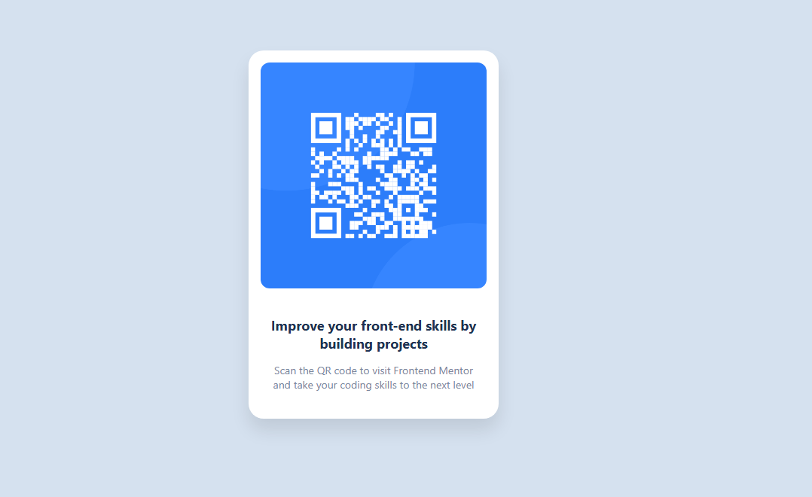

# Frontend Mentor - QR code component solution

This is a what i done to the [QR code component challenge on Frontend Mentor](https://code-componen.netlify.app/). this looks similar to what i was consideling on

## Table of contents

- [Overview](#overview)
  - [Screenshot](#screenshot)
  - [Links](#links)
- [My process](#my-process)
  - [Built with](#built-with)
  - [What I learned](#what-i-learned)
  - [Continued development](#continued-development)
  - [Useful resources](#useful-resources)
- [Author](#author)
- [Acknowledgments](#acknowledgments)

## Overview

this project shows the bix that contain the qr cide it also show the flexbox in css

### Screenshot




### Links

- Solution URL: [you can see what i did here](https://code-componen.netlify.app/)

## My process

### Built with

- Semantic HTML5 markup
- CSS custom properties
- Flexbox
- CSS Grid
- Mobile-first workflow

### What I learned

this project teaches me about orgnaising my html elent

To see how you can add code snippets, see below:

```html
<!DOCTYPE html>
<html lang="en">
<head>
  <meta charset="UTF-8">
  <meta name="viewport" content="width=device-width, initial-scale=1.0">
  <title>QR Code Card</title>
  <link rel="stylesheet" href="style/style.css">
</head>
<body>
  <div class="card">
    
    <div class="card-text">
      <h1>Improve your front-end skills by building projects</h1>
      <p>Scan the QR code to visit Frontend Mentor and take your coding skills to the next level</p>
    </div>
  </div>
</body>
</html>

```
```css
body {
    background-color: #d5e1ef;
    font-family: 'Segoe UI', Tahoma, Geneva, Verdana, sans-serif;
    display: flex;
    justify-content: center;
    align-items: center;
    height: 100vh;
    margin: 0;
  }
  
  .card {
    background-color: #ffffff;
    border-radius: 20px;
    box-shadow: 0 15px 25px rgba(0, 0, 0, 0.1);
    width: 300px;
    padding: 16px;
    text-align: center;
  }
  
  .qr-image {
    width: 100%;
    border-radius: 12px;
  }
  
  .card-text {
    padding: 20px 12px;
  }
  
  .card-text h1 {
    font-size: 18px;
    color: #1f3251;
    margin-bottom: 14px;
  }
  
  .card-text p {
    font-size: 14px;
    color: #7b879d;
    margin: 0;
  }
  
```

### Continued development

 i'm atill see how it will be responsive than how it is


### Useful resources

- [google fonts](https://www.googlefonts.com) - This helped me for importing diffrent fonts used inn all this project. I really liked this pattern and will use it going forward.
- [some git hub repo](https://github.com/samanthaming/Flexbox30) - This is an amazing article which helped me finally understand flexbox and grid. I'd recommend it to anyone still learning this concept.

## Author

- Frontend Mentor - [@muganga-eric](https://www.frontendmentor.io/profile/yourusername)
- Twitter - [@muganga Eric](https://www.twitter.com/yourusername)
